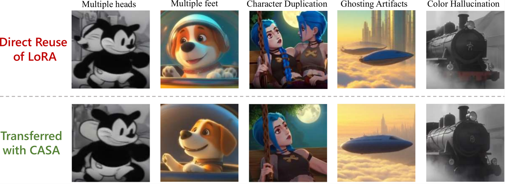

<div align="center">

# CASA

**Cluster-Aware Spectral Arbitration for data-free LoRA transfer in video diffusion models**

[](#installation)
[](#what-casa-does)
[](#target-model-inference)

</div>



## Overview

This repository contains the code for **CASA**, the method from
**"Exploring Data-Free LoRA Transferability for Video Diffusion Models"**.

The paper studies a common failure case in current video diffusion model
ecosystems: a LoRA trained on a base model, such as Wan2.1, often works poorly
when directly reused on a distilled variant of that model. The model may keep
the intended style only weakly, or produce artifacts such as duplicated body
parts, ghosting, structural collapse, and color hallucination.

CASA addresses this without retraining the LoRA and without using user data. It
transfers a source-model LoRA into the weight space of a distilled target model
by operating in the source model's singular subspaces.

## What CASA Does

The paper's main observation is that both full fine-tuning/distillation and
LoRA adaptation preserve much of the model's singular value structure, but they
create different routing patterns inside shared spectral clusters. Direct LoRA
reuse can therefore create **spectral interference**: some routing paths are
over-activated, while others cancel the LoRA effect.

CASA formulates LoRA transfer as a cluster-aware arbitration problem:

- project the original LoRA update into the source model SVD basis;
- project the source-to-target model drift into the same basis as `Cfft`;
- identify dominant routing regions induced by distillation;
- restore LoRA routing in non-dominant regions;
- arbitrate high-risk dominant regions to avoid over-activation;
- reconstruct new LoRA factors for the target model.

The result is a converted LoRA checkpoint that can be loaded by the distilled
target model.

## Repository Layout

```text
.
|-- CASA.pdf                         # Paper PDF
|-- README.md                        # This file
|-- transfer.py                      # CASA implementation
|-- run_lora_transfer.py             # CLI wrapper for LoRA transfer
|-- utils.py                         # Pickle loading and layer-name mapping helpers
|-- examples/
|   |-- compute_svd_example.py       # Example: source model SVD preprocessing
|   `-- compute_cfft_example.py      # Example: target drift projection preprocessing
|-- Krea/                            # Krea Realtime 14B inference integration
`-- RollingForcing/                  # Rolling Forcing inference integration
```

The root-level scripts are the CASA transfer code. The `Krea/` and
`RollingForcing/` directories are target-model inference projects with LoRA
loading support added.

## Installation

For the root CASA transfer scripts:

```bash
conda create -n casa python=3.10 -y
conda activate casa
pip install torch safetensors scipy numpy
```

For the preprocessing examples, install the model-loading dependencies needed
by your source and target checkpoints. The included Wan example uses Diffusers:

```bash
pip install diffusers transformers accelerate
```

The current transfer implementation moves tensors to CUDA internally, so run it
on a machine with an NVIDIA GPU and a working CUDA-enabled PyTorch install.

## Required Inputs

CASA needs three inputs:

1. **Source LoRA**

   A LoRA checkpoint trained on the source/base video diffusion model, usually
   in `.safetensors` format. The script supports common paired key formats:
   `lora_A.weight` / `lora_B.weight` and `lora_down.weight` / `lora_up.weight`.

2. **Source SVD dictionary**

   A pickle file, or several sharded pickle files, mapping each source layer to:

   ```python
   {
       "U": U,
       "S": S,
       "Vh": Vh,
   }
   ```

   See `examples/compute_svd_example.py` for a Wan2.1-T2V-14B template.

3. **Target `Cfft` dictionary**

   A pickle file, or matching sharded pickle files, mapping each layer to the
   source-basis projection of the source-to-target weight drift:

   ```python
   Cfft = U_source.T @ (W_target - W_source) @ Vh_source.T
   ```

   See `examples/compute_cfft_example.py` for a template using a Wan source
   model and a Krea target checkpoint.

Layer names must match between the LoRA, source SVD dictionary, and target
`Cfft` dictionary. If your checkpoints use different naming conventions, update
the mapping logic in `utils.py`.

## Quick Start

### 1. Precompute Source SVD

Adapt the paths and model IDs in:

```bash
python examples/compute_svd_example.py
```

For large models, the example writes SVD results in multiple parts to reduce
memory pressure.

### 2. Precompute Target `Cfft`

Adapt the target checkpoint path and SVD paths in:

```bash
python examples/compute_cfft_example.py
```

This step is done once per source-target model pair.

### 3. Transfer a LoRA

Single-file mode:

```bash
python run_lora_transfer.py \
  --lora-path /path/to/source_lora.safetensors \
  --svd-src-path /path/to/source_svd.pkl \
  --cfft-path /path/to/target_cfft.pkl \
  --output-path /path/to/casa_transferred_lora.safetensors \
  --method CASA \
  --transfer-kwargs '{"rotation_threshold":0.5,"q_threshold":0.5,"arbitrate_q":0.85,"target_rank":32}'
```

Multi-part mode:

```bash
python run_lora_transfer.py \
  --lora-path /path/to/source_lora.safetensors \
  --svd-src-pattern '/path/to/source_svd_part{part}.pkl' \
  --cfft-pattern '/path/to/target_cfft_part{part}.pkl' \
  --num-parts 8 \
  --output-path /path/to/casa_transferred_lora.safetensors \
  --method CASA \
  --transfer-kwargs '{"rotation_threshold":0.5,"q_threshold":0.5,"arbitrate_q":0.85,"target_rank":32}'
```

## CLI Arguments

- `--lora-path`: input source LoRA checkpoint.
- `--output-path`: output path for the transferred LoRA.
- `--method`: transfer method name. Currently `CASA`.
- `--load-device`: device used when loading SVD and `Cfft` pickle files.
- `--ignore-keyword`: skip LoRA layers whose names contain this keyword. Can be
  passed multiple times.
- `--transfer-kwargs`: JSON object forwarded to the CASA function.
- `--svd-src-path` and `--cfft-path`: single-file preprocessing inputs.
- `--svd-src-pattern`, `--cfft-pattern`, and `--num-parts`: sharded
  preprocessing inputs. Patterns must contain `{part}`.

Important CASA kwargs:

- `rotation_threshold`: threshold for building perturbation-based singular
  clusters.
- `q_threshold`: quantile threshold for detecting dominant routing regions.
- `arbitrate_q`: quantile threshold for high-risk over-activation arbitration.
- `target_rank`: rank of the reconstructed target LoRA.

## Target Model Inference

After generating `casa_transferred_lora.safetensors`, use the target-specific
inference code.

For Krea Realtime 14B:

```bash
cd Krea
python inference.py \
  --config_path configs/self_forcing_server_14b.yaml \
  --output_dir outputs/casa_lora \
  --lora_path /path/to/casa_transferred_lora.safetensors \
  --lora_scale 1.0 \
  --fps 24
```

For Rolling Forcing:

```bash
cd RollingForcing
python inference.py \
  --config_path configs/rolling_forcing_dmd.yaml \
  --checkpoint_path checkpoints/rolling_forcing_dmd.pt \
  --data_path prompts/example_prompts.txt \
  --output_folder videos/casa_lora \
  --num_output_frames 126 \
  --use_ema \
  --lora_path /path/to/casa_transferred_lora.safetensors \
  --lora_scale 1.0
```

See `Krea/README.md` and `RollingForcing/README.md` for environment setup,
checkpoint downloads, and additional inference options.

## Practical Notes

- SVD and `Cfft` preprocessing are one-time costs. Once they are computed for a
  source-target pair, transferring another LoRA only requires the LoRA file.
- The example preprocessing scripts are templates. Update checkpoint paths,
  model IDs, layer filters, and key mappings for your own model family.
- The transfer script only processes layers that can be matched to both the
  source SVD and target `Cfft` dictionaries.
- For very large models, prefer sharded SVD and `Cfft` files and run
  `run_lora_transfer.py` in multi-part mode.

## Acknowledgements

This repository builds on video diffusion and distilled inference code from:

- [Wan2.1](https://github.com/Wan-Video/Wan2.1)
- [Krea Realtime Video](https://huggingface.co/krea/krea-realtime-video)
- [Rolling Forcing](https://github.com/TencentARC/RollingForcing)
